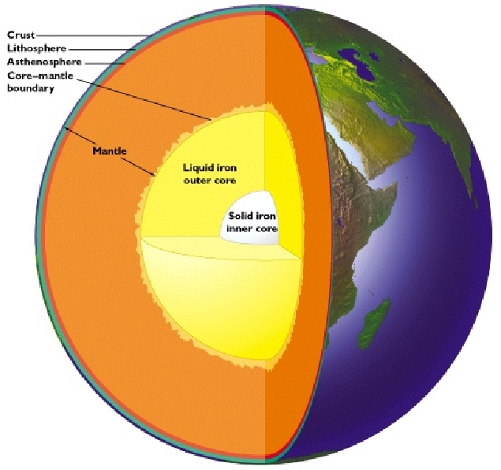
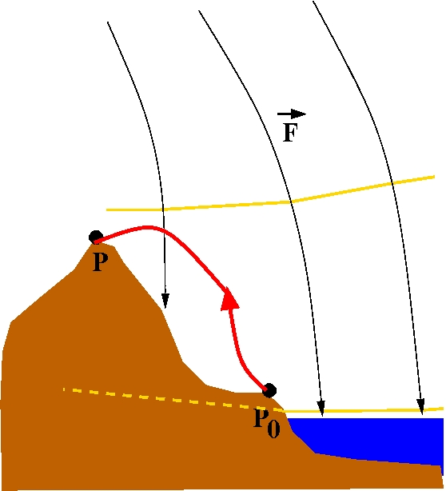
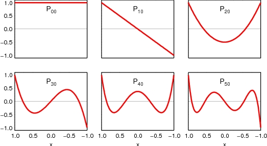
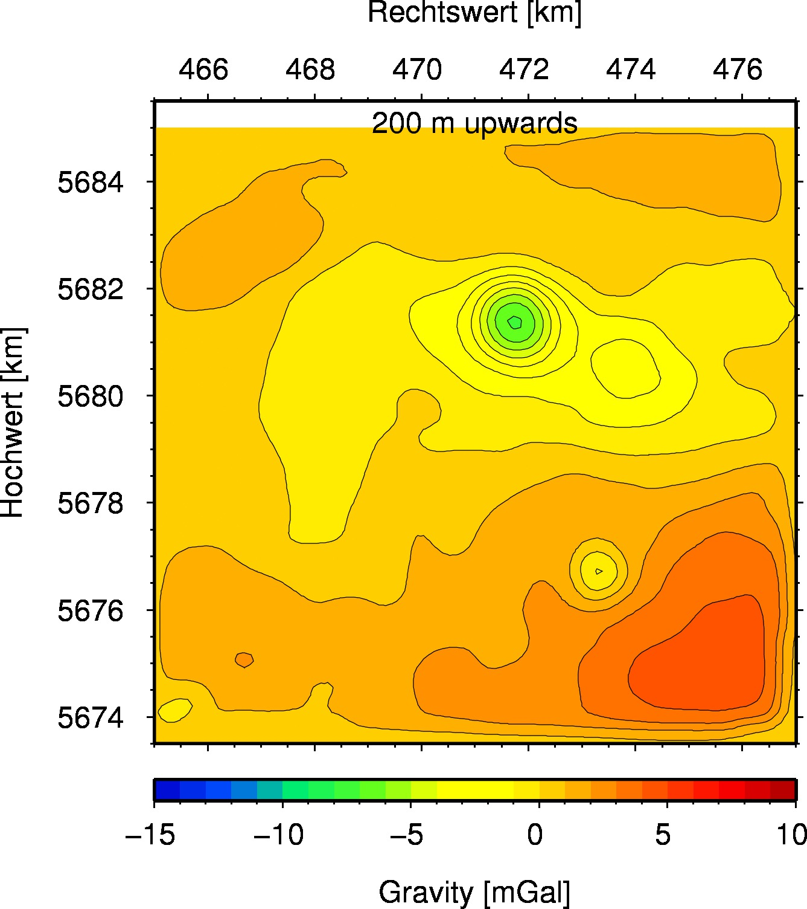
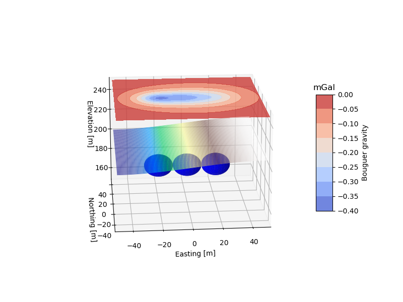
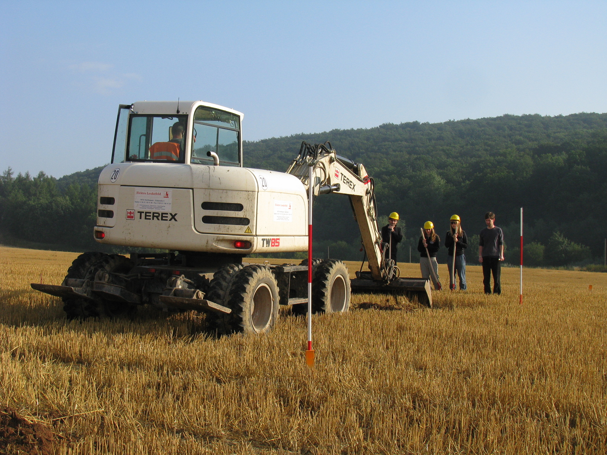

<meta http-equiv="Content-Type" content="text/html; charset=utf-8"/>
<table>
<tr><td></td>
<td bgcolor="#CDCDCD" style="width:600px">
<h1>Angewandte Geophysik II</h1>
<h2>Georg Kaufmann</h2>
</td>
</tr>
</table>

Bachelor course tought at [Freie Universität Berlin](http://fu-berlin.de) in the 
**B.Sc. Geological Sciences** program.

## Course summary

In dieser Vorlesung besprechen wir die **mathematischen Grundlagen** der angewandten Geophysik, z.B. die 
**Potentialtheorie** und **Kugelfunktionen**. Wir diskutieren folgende Methoden in Detail:

- Gravimetrie
- Geomagnetik
- Geoelektrik
- Georadar

Wir schliessen die Vorlesung mit **Filterung**, **Modellierung**, und der Diskussion **zahlreicher Feldmessungen** ab.

## Course instructor

[Georg Kaufmann](http://userpage.fu-berlin.de/~geodyn)<br>
Freie Universität Berlin<br>
Department of Geosciences, Institute of Geological Sciences, Geophysics Section<br>
Malteserstr. 74-100, 12249 Berlin, Haus D, Raum D127<br>
[georg.kaufmann@fu-berlin.de](mailto:georg.kaufmann@fu-berlin.de)

## Course How-To

- You should follow the lectures, preferrably in consecutive order.
- In each lecture, we start with an overview, then as main part the self-learning lecture notes can be downloaded.
- Then, a practical part follows, which is often a link to a python page for simple programming exercises, or some homework.

## Lectures

The lecture series is compiled as handouts in **pdf** format
(click on title):

<table>
<tr>
<td style="height: 30px;vertical-align:top;text-align:center">
<a href="handouts/Lecture_AngewandteII_00_Vorbemerkung_handout.pdf">0. Vorbemerkung</a> <br></td>
<td style="height: 30px;vertical-align:top;text-align:center">
<a href="handouts/Lecture_AngewandteII_01_Einleitung_handout.pdf">1. Einleitung</a> <br></td>
<td style="height: 30px;vertical-align:top;text-align:center">
<a href="handouts/Lecture_AngewandteII_02_Potentialtheorie_handout.pdf">2. Potentialtheorie</a> <br></td>
</tr>
<tr>
<td style="height: 30px;vertical-align:top;text-align:center">
<a href="handouts/Lecture_AngewandteII_03_Kugelfunktionen_handout.pdf">3. Kugelfunktionen</a> <br></td>
<td style="height: 30px;vertical-align:top;text-align:center">
<a href="handouts/Lecture_AngewandteII_04_Grundgleichungen_handout.pdf">4. Grundgleichungen</a> <br></td>
<td style="height: 30px;vertical-align:top;text-align:center">
<a href="handouts/Lecture_AngewandteII_05_Gravimetrie_handout.pdf">5. Gravimetrie</a> <br></td>
</tr>
<tr>
<td style="height: 30px;vertical-align:top;text-align:center">
<a href="handouts/Lecture_AngewandteII_06_Magnetik_handout.pdf">6. Magnetik</a> <br></td>
<td style="height: 30px;vertical-align:top;text-align:center">
<a href="handouts/Lecture_AngewandteII_07_Geoelektrik_handout.pdf">7. Geoelektrik</a> <br></td>
<td style="height: 30px;vertical-align:top;text-align:center">
<a href="handouts/Lecture_AngewandteII_08_Georadar_handout.pdf">8. Georadar</a> <br></td>
</tr>
<tr>
<td style="height: 30px;vertical-align:top;text-align:center">
<a href="handouts/Lecture_AngewandteII_09_Filterung_handout.pdf">9. Filterung</a> <br></td>
<td style="height: 30px;vertical-align:top;text-align:center">
<a href="handouts/Lecture_AngewandteII_10_Modellierung_handout.pdf">10. Modellierung</a> <br></td>
<td style="height: 30px;vertical-align:top;text-align:center">
<a href="handouts/Lecture_AngewandteII_11_Interpretation_handout.pdf">11. Interpretation</a> <br></td>

</tr>
</table>

## Exercises

The exercises are mainly **jupyter** notebooks, which can be accessed interactively through<br>
[](https://mybinder.org/v2/gh/georgkaufmann/lecture_agII.git/main?filepath=index.ipynb)

A list of notebooks can be found here:

- <a href="README_Notebooks.md" target="_blank">List of Juypter notebooks</a>

## Download
```
git clone https://github.com/georgkaufmann/lecture_agII.git
```

## Versioning

We use [Git](https://git-scm.com/) for versioning.

## Authors

* **Georg Kaufmann** - *Initial work* - [Georg Kaufmann](http://userpage.fu-berlin.de/~geodyn)


## License

This project is licensed for classroom use only.

## Acknowledgments
